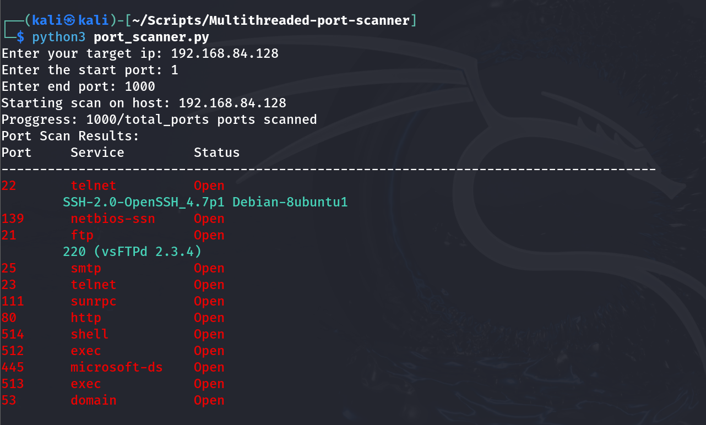

# Multithreaded Port Scanner

## Description
A Python-based multithreaded TCP port scanner that scans a target host for open ports, identifies common services, and performs banner grabbing for service enumeration.

## Features
- Multi-threaded port scanning
- Fast TCP port discovery
- Service detection using port mapping
- Banner grabbing for service identification
- User-defined port range scanning
- Simple command-line interface

## Technologies Used
- Python 3
- Socket Programming
- Concurrent Futures (ThreadPoolExecutor)

## Installation

```bash
git clone https://github.com/Vinaynagari795/Multithreaded-port-scanner.git
cd Multithreaded-port-scanner
```

## Usage

```bash
python3 port_scanner.py
```

## Sample Output



Example:

```text
Enter your target ip: 192.168.1.1
Enter the start port: 20
Enter end port: 1000
```

## Skills Demonstrated
- Network Scanning
- Service Enumeration
- Banner Grabbing
- Python Automation
- Multithreading
- Cybersecurity Fundamentals

## Project Structure

```text
Multithreaded-port-scanner/
├── port_scanner.py
├── README.md
└── screenshots/
    └── scan-result.png
```

## Disclaimer

This project was developed for educational purposes and authorized security testing only. Do not use this tool against systems without proper permission.

## Author

**Vinay Nagari**  
CEH | OSCP | CPENT
